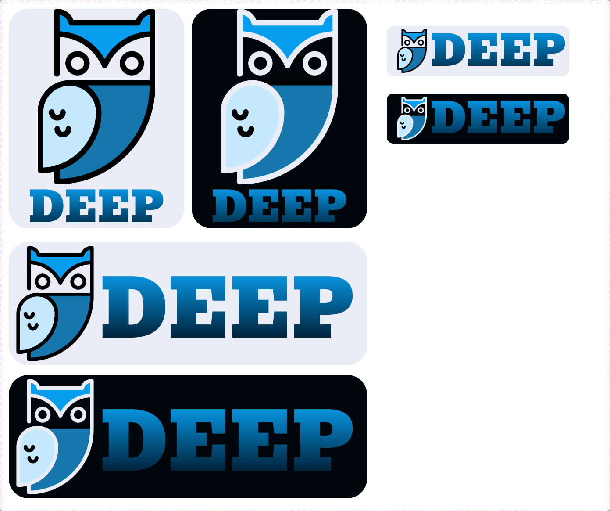
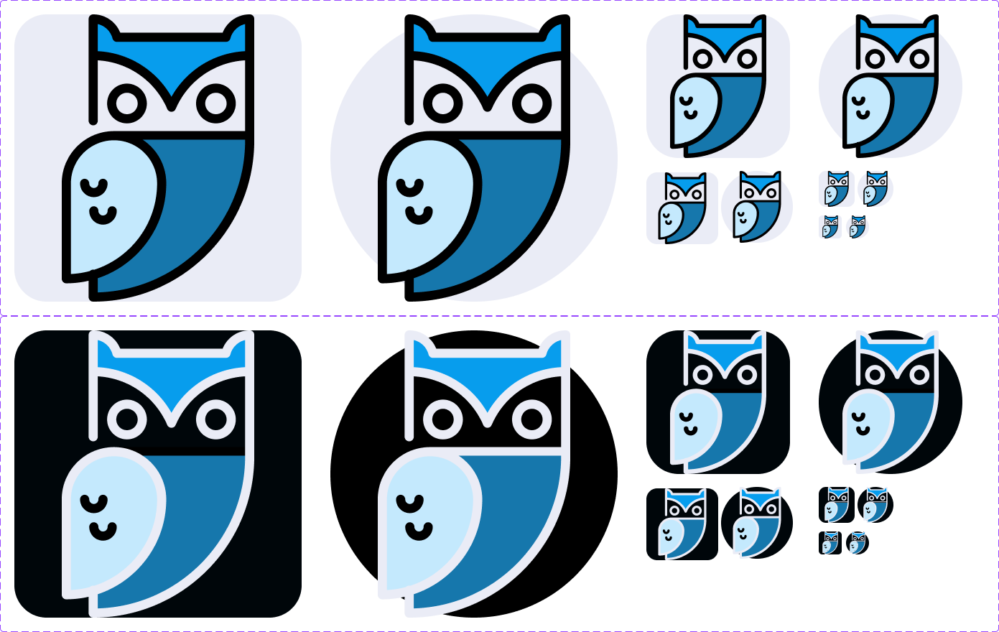

# Duran Enterprise Logo Usage Guidelines

## Table of Contents

- [Duran Enterprise Logo Usage Guidelines](#duran-enterprise-logo-usage-guidelines)
  - [Table of Contents](#table-of-contents)
    - [General Usage Terms and Conditions](#general-usage-terms-and-conditions)
    - [Logo Variations](#logo-variations)
      - [Full Logos](#full-logos)
      - [Simplified Logos](#simplified-logos)
    - [Colors](#colors)
      - [Primary Colors](#primary-colors)
      - [Background](#background)
      - [Usage Examples](#usage-examples)
    - [Additional Guidelines](#additional-guidelines)
    - [Contact](#contact)

### General Usage Terms and Conditions

1. <strong>Permitted Use</strong>: Users are allowed to use the Duran Enterprise logo for promotional and informational purposes related to Duran Enterprise, the DEEP project and other products offered by our company subject to compliance with these guidelines.

2. <strong>Logo Integrity</strong>: Users should not modify, alter, or distort the logo in any way, including changing its colors, proportions, or any design elements. The logo should be used in its original form and proportions without **EXPLICIT** approval from the owner. Kindly send an [email](emailto:denverjames.duran19@outlook.com) for any inquiries on possible modification for certain projects. You can also reach out via [Discord](discordapp.com/users/1086421084523475055).

3. <strong>Exclusive Use</strong>: The Duran Enterprise logo should exclusively be used in connection with Duran Enterprise's products, services, or official communications. Its use in any other context or for other products is <strong><em>strictly prohibited.</em></strong>

4. <strong>Clear Space</strong>: When using the logo, ensure there is ample clear space around it to maintain visibility and readability. Do not place text, graphics, or other elements too close to the logo.

5. <strong>Minimum Size</strong>: Maintain the minimum size requirements to ensure legibility. Do not scale the logo below the 32 x 32 px.

### Logo Variations

#### Full Logos

  
#### Simplified Logos

### Colors

#### Primary Colors
- **Blue (#1677AC):** This is the primary color of the Duran Enterprise logo and should be used for most applications.

#### Background
- **Dark Background (#00060A):** This color represents the canvas for the logo and symbolizes the depth of knowledge and the beginning of the educational journey.

- **Light Background (#EAECF6):** This color represents knowledge illumination and the clarity that Duran Enterprise aims to provide.

#### Usage Examples
- Use the primary logo on light backgrounds whenever possible for maximum clarity and contrast.
- Use the primary logo on dark backgrounds when necessary for aesthetic or branding purposes.
- The simplified logo can be used when space or size limitations prevent the use of the full logo.

### Additional Guidelines

- The Duran Enterprise logo should not be incorporated into any other logos, marks, or symbols.
- Users should not claim any endorsement, partnership, or affiliation with Duran Enterprise unless officially authorized to do so.
- Duran Enterprise reserves the right to take legal action against any unauthorized or improper use of its logo.

### Contact

For any questions or specific usage requests not covered by these guidelines, please contact [denverjames.duran19@outlook.com](mailto:denverjames.duran19@outlook.com) or [DDuran19](discordapp.com/users/1086421084523475055) on discord for assistance.

Duran Enterprise reserves the right to update these guidelines at any time and without prior notice.
