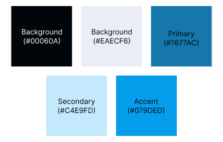

# Duran Enterprise

## Table of Contents
- [Duran Enterprise](#duran-enterprise)
  - [Table of Contents](#table-of-contents)
  - [Color Palette](#color-palette)
    - [CSS](#css)
  - [Logo](#logo)
    - [Resources](#resources)
    - [Symbolism](#symbolism)
    - [Meaning](#meaning)


## Color Palette
<p align="center">
    
</p>


- **Dark Background (`#00060A`)**: The dark background serves as the canvas for the logo, symbolizing the depth of knowledge and the unexplored territory of learning. It represents the beginning of the educational journey.

- **Light Background (`#EAECF6`)**: The light background represents the illumination of knowledge. It signifies the clarity and understanding that Duran Enterprise aims to provide to its audience.

- **Primary Color (`#1677AC`)**: The primary color, a shade of blue, embodies trust, stability, and professionalism. It reflects the reliability of Duran Enterprise as a source of educational resources.

- **Secondary Color (`#C4E9FD`)**: The secondary color, a lighter blue, complements the primary color and conveys a sense of freshness and innovation. It symbolizes the dynamic nature of learning and staying up-to-date with the latest educational content.

- **Accent Color (`#079DED`)**: The accent color, a vibrant blue, adds a touch of energy and enthusiasm. It represents the excitement of acquiring new knowledge and the aspiration to excel in the field of programming.

### CSS
<details>
    <summary>Regular CSS</summary>

```css
@media (prefers-color-scheme: light) {
    :root {
        --text: #00060a;
        --background: #eaecf6;
        --primary: #1677ac;
        --secondary: #c4e9fd;
        --accent: #079ded;
    }
}
    @media (prefers-color-scheme: dark) {
    :root {
        --text: #f5fbff;
        --background: #090b15;
        --primary: #53b4e9;
        --secondary: #02273b;
        --accent: #12a7f8;
    }
}
```
</details>

<details>
<summary>Tailwind (tailwind.config.js)</summary>

```javascript 
// Tailwind CSS Configuration (`tailwind.config.js`)
module.exports = {
    colors: {
        'text': {
            50: 'var(--text-50)',
            100: 'var(--text-100)',
            200: 'var(--text-200)',
            300: 'var(--text-300)',
            400: 'var(--text-400)',
            500: 'var(--text-500)',
            600: 'var(--text-600)',
            700: 'var(--text-700)',
            800: 'var(--text-800)',
            900: 'var(--text-900)',
            950: 'var(--text-950)',
        },
        'background': {
            50: 'var(--background-50)',
            100: 'var(--background-100)',
            200: 'var(--background-200)',
            300: 'var(--background-300)',
            400: 'var(--background-400)',
            500: 'var(--background-500)',
            600: 'var(--background-600)',
            700: 'var(--background-700)',
            800: 'var(--background-800)',
            900: 'var(--background-900)',
            950: 'var(--background-950)',
        },
        'primary': {
            50: 'var(--primary-50)',
            100: 'var(--primary-100)',
            200: 'var(--primary-200)',
            300: 'var(--primary-300)',
            400: 'var(--primary-400)',
            500: 'var(--primary-500)',
            600: 'var(--primary-600)',
            700: 'var(--primary-700)',
            800: 'var(--primary-800)',
            900: 'var(--primary-900)',
            950: 'var(--primary-950)',
        },
        'secondary': {
            50: 'var(--secondary-50)',
            100: 'var(--secondary-100)',
            200: 'var(--secondary-200)',
            300: 'var(--secondary-300)',
            400: 'var(--secondary-400)',
            500: 'var(--secondary-500)',
            600: 'var(--secondary-600)',
            700: 'var(--secondary-700)',
            800: 'var(--secondary-800)',
            900: 'var(--secondary-900)',
            950: 'var(--secondary-950)',
        },
        'accent': {
            50: 'var(--accent-50)',
            100: 'var(--accent-100)',
            200: 'var(--accent-200)',
            300: 'var(--accent-300)',
            400: 'var(--accent-400)',
            500: 'var(--accent-500)',
            600: 'var(--accent-600)',
            700: 'var(--accent-700)',
            800: 'var(--accent-800)',
            900: 'var(--accent-900)',
            950: 'var(--accent-950)',
        },
    },
};

```
</details>

<details>
<summary>Tailwind (main.css)</summary>

```css
@layer base {
    :root {
        --text-50: #e5f5ff;
        --text-100: #ccebff;
        --text-200: #99d6ff;
        --text-300: #66c2ff;
        --text-400: #33adff;
        --text-500: #0099ff;
        --text-600: #007acc;
        --text-700: #005c99;
        --text-800: #003d66;
        --text-900: #001f33;
        --text-950: #000f1a;
        
        --background-50: #edeff7;
        --background-100: #dbdff0;
        --background-200: #b8bee0;
        --background-300: #949ed1;
        --background-400: #707ec2;
        --background-500: #4d5eb3;
        --background-600: #3d4b8f;
        --background-700: #2e386b;
        --background-800: #1f2547;
        --background-900: #0f1324;
        --background-950: #080912;
        
        --primary-50: #e8f5fc;
        --primary-100: #d2ebf9;
        --primary-200: #a5d8f3;
        --primary-300: #78c4ed;
        --primary-400: #4ab1e8;
        --primary-500: #1d9de2;
        --primary-600: #177eb5;
        --primary-700: #125e87;
        --primary-800: #0c3f5a;
        --primary-900: #061f2d;
        --primary-950: #031017;
        
        --secondary-50: #e6f6fe;
        --secondary-100: #ceedfd;
        --secondary-200: #9ddafb;
        --secondary-300: #6bc8fa;
        --secondary-400: #3ab5f8;
        --secondary-500: #09a3f6;
        --secondary-600: #0782c5;
        --secondary-700: #056294;
        --secondary-800: #044162;
        --secondary-900: #022131;
        --secondary-950: #011019;
        
        --accent-50: #e6f6fe;
        --accent-100: #ceedfd;
        --accent-200: #9cdafc;
        --accent-300: #6bc8fa;
        --accent-400: #39b6f9;
        --accent-500: #08a3f7;
        --accent-600: #0683c6;
        --accent-700: #056294;
        --accent-800: #034163;
        --accent-900: #022131;
        --accent-950: #011019;
        
    }
    .dark {
        --text-50: #e5f5ff;
        --text-100: #ccebff;
        --text-200: #99d6ff;
        --text-300: #66c2ff;
        --text-400: #33adff;
        --text-500: #0099ff;
        --text-600: #007acc;
        --text-700: #005c99;
        --text-800: #003d66;
        --text-900: #001f33;
        --text-950: #000f1a;
        
        --background-50: #edeff7;
        --background-100: #dbdff0;
        --background-200: #b8bee0;
        --background-300: #949ed1;
        --background-400: #707ec2;
        --background-500: #4d5eb3;
        --background-600: #3d4b8f;
        --background-700: #2e386b;
        --background-800: #1f2547;
        --background-900: #0f1324;
        --background-950: #080912;
        
        --primary-50: #e8f5fc;
        --primary-100: #d2ebf9;
        --primary-200: #a5d8f3;
        --primary-300: #78c4ed;
        --primary-400: #4ab1e8;
        --primary-500: #1d9de2;
        --primary-600: #177eb5;
        --primary-700: #125e87;
        --primary-800: #0c3f5a;
        --primary-900: #061f2d;
        --primary-950: #031017;
        
        --secondary-50: #e6f6fe;
        --secondary-100: #ceedfd;
        --secondary-200: #9ddafb;
        --secondary-300: #6bc8fa;
        --secondary-400: #3ab5f8;
        --secondary-500: #09a3f6;
        --secondary-600: #0782c5;
        --secondary-700: #056294;
        --secondary-800: #044162;
        --secondary-900: #022131;
        --secondary-950: #011019;
        
        --accent-50: #e6f6fe;
        --accent-100: #ceedfd;
        --accent-200: #9cdafc;
        --accent-300: #6bc8fa;
        --accent-400: #39b6f9;
        --accent-500: #08a3f7;
        --accent-600: #0683c6;
        --accent-700: #056294;
        --accent-800: #034163;
        --accent-900: #022131;
        --accent-950: #011019;
        
        }
    },

```

</details>

<details>
<summary>SASS</summary>

```javascript
$themes: (
    light: (
        text: #00060a,
        background: #eaecf6,
        primary: #1677ac,
        secondary: #c4e9fd,
        accent: #079ded,
    ),
    dark: (
        text: #f5fbff,
        background: #090b15,
        primary: #53b4e9,
        secondary: #02273b,
        accent: #12a7f8,
    ),
);
```
</details>

## Logo
<p align="center">
    
</p>

### Resources
- [figma](https://www.figma.com/file/MChMOxFDqczUpY9be3wxOI/Company-Logo?type=design&node-id=3%3A177&mode=design&t=N5fJHcNGSmWpyHR5-1)

### Symbolism

**Owl**: The central element of the logo is the owl, which is a symbol deeply associated with wisdom and knowledge. Owls are renowned for their keen perception and ability to see through darkness, representing insight and enlightenment. In the context of Duran Enterprise, the owl embodies the pursuit of knowledge and education.

**Abstract Geometric Shapes**: The owl is rendered using simple geometric shapes, emphasizing clarity and simplicity. This design choice reflects the company's commitment to delivering educational content and tools in a clear and understandable manner.

### Meaning

The Duran Enterprise logo symbolizes the company's dedication to promoting wisdom and knowledge through accessible and straightforward educational resources. The owl, depicted using clean geometric shapes, signifies the company's commitment to delivering these resources with clarity and simplicity, making learning and programming more approachable for its audience.

The color palette enhances the logo's meaning: the dark background symbolizes the beginning of the educational journey, the light background represents knowledge illumination, and the blue tones reflect trust, innovation, and the excitement of learning.

Our logo communicates that Duran Enterprise is a trusted and dynamic source of educational content and tools, guiding individuals on their journey of learning and skill development in the world of programming.
